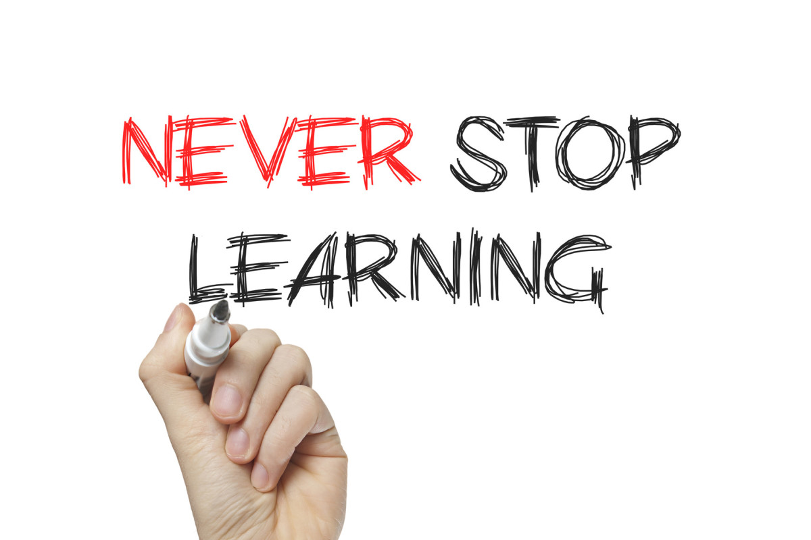
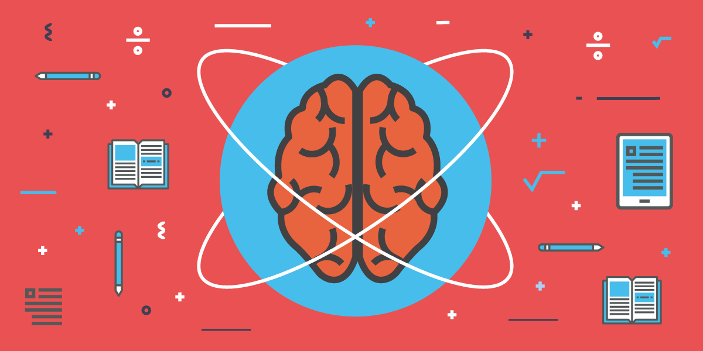

# Lifelong Learning#

As a student aspiring to be a computer engineer, we are continuously familiarized with the latest technology, protocols, and standards. However, if the past were to teach us anything, we can only stand to reason that the future will only hold more development, new standards and protocols and new, interesting ideas. Technology has boomed in the recent years and if you don’t keep up, you will almost certainly fall behind.

If I want to remain effective as a computer engineer and be able to compete with the individuals who come out of college while I’m in the workforce, I need to continue to learn, think, and be aware of the ever-changing world around me. It will be a necessity for me to be a lifelong learner.

Section 2 describes what is lifelong learning and what a lifelong learner is, Section 3 covers the importance of lifelong learning, and Section 4 contains concluding remarks.

# Section 2 - What is Lifelong Learning?#

Lifelong learning to me is much more than just constantly learning throughout one’s life. Lifelong learning to means that you continuously have the drive, motivation, and desire to explore, be curious, and ask questions.

Being a lifelong learning can help my career by maintaining my brain’s health, keeping up with the ever-changing world around me, and lets me have fun and enjoy my career throughout my life.

There are forms of formal education that offer structure and credibility with very little preparation or research needed by the individual.

The University of Hawaii at Manoa offers the Osher Lifelong Learning Program. This program offers individuals non-credit, college-level courses as well as other activities in hopes of engaging their minds, enriching their lives and serving the community. [1] This program offers a Fall, Summer and Spring Term for $60 and it includes up to 3 courses, library privileges, and be integrated into the University of Hawaii community.

I’ve personally spoken to a woman on a consistent basis who was enrolled in this program who took nutrition, geography, and religion classes. I’ve heard nothing but positive and welcoming experiences from her anecdotes.

Currently, I am not a member of this program, however; I can see many ways that a program like this could benefit me in the future. A program like this allows an individual to explore a wide variety of interests in a structured, well-taught manner. I have a strong interest in math and sciences, so I can continue to pursue my interests after I graduate and start my career.

MIT OpenCourseWare is very similar to lifelong learning programs offered at colleges except that MIT OpenCourseWare and other services like it operate purely online. This is an added convenience to those with limited time, the inability to travel, or hesitant about committing to an entire term. According to MIT News, back in 2011, over 75 million visits by 45 million individuals followed courses in Physics, Engineering, Math, and other programs. [4]

I have personally used MIT OpenCourseWare for a course in iOS application design. There were video lectures, reading material, and assignments that were available for free. This resource can benefit me in my career because I can learn almost anything I want from the comfort of my own home on my own time. As a computer engineer, there are always more languages, techniques and styles to be learned. MIT OpenCourseWare will definitely be useful in the future.

The previous two lifelong learning methods provide the benefits of personal gain and learning, however no concrete indication or certification is given. The option of going to back to a university and furthering your degree or getting another degree will allow you to learn and upon completion can award a degree that has the potential to give you more options to further progress your career.

On average, an individual with a master’s degree made approximately $30,000 more than an individual with a comparable undergraduate degree per year. [5] I hope to personally take advantage of this opportunity in the future. Computer Science master’s degree holders earned $81,200 on average compared to $63,100 for bachelor’s degree holders. By taking advantage of this learning opportunity, I may have the option to make more money and work on more interesting work.

There are many informal educational opportunities that require a little more self-initiative and research on the part of the individual.

New age media presents many opportunities for learning at all ages. Video content website such as YouTube offer content that are created for a wide variety of audiences. There are many videos that are meant to educate and inform viewers on topics such as current events, STEM topics, or just plain interesting ideas. According to Forbes, the Educational category is viewed twice as often as the Pets & Animal category. [6]

I personally use this lifelong learning opportunity almost everyday. Learning doesn’t really feel like learning when you’re browsing on YouTube learning about science, technology and interesting math topics. This method can be used in my career when I need to reference something quickly or visually need to learn something, YouTube is a very useful resource. Having the option to have a topic explained to you along with a visual is invaluable to a visual learning such as me.

Another form of content consumption that can be used as a lifelong learning opportunity is to subscribe to technology magazines such as Popular Science or IEEE Spectrum. These magazines often have the latest, bleeding edge technology with interesting articles meant for casual reading. Not everyone who is interested in learning wants to read research papers and scholarly articles. Magazines commonly offer articles with visuals and tables and diagrams that are easy to understand and interesting.

I used to be subscribed to Popular Science and Popular Mechanics and loved reading the articles and looking at all the new technology. It really got me interested and excited and encouraged me to do more research and learning on my own. In the future, magazines can offer entertainment along with keeping up to date with the latest technology and ideas.

Any forms of writing such as creative writing or educational writing is an easy and always accessible way of lifelong learning. Writing in general utilizes a different hemisphere of the brain than most of the analytical work that a computer engineer would be using. Using both hemispheres of the brain is provides benefits to the entire brain. [7] Also, writing is an important skill in any field of study. The ability to communicate effectively is invaluable in a team setting such as working in engineering groups.

I personally do not write as much as a should. This lifelong learning opportunity is useful to anyone, however when trying to communicate, being an effective writer is an invaluable skill to have. Also maintaining my entire brain can only be helpful to my future health.

There are many lifestyle changes that lead to lifelong learning in many direct and indirect ways.

You can make an effort to surround yourself with other individuals who have the same goal to achieve lifelong learning. Jim Rohn said, “You are the average of the five people you spend the most time with.” [8] The idea that if you surround yourself with success, you will be successful holds the same in this situation, if you surround yourself with individuals who want to be lifelong learners, you yourself will become a better lifelong learner.

There is also the idea that if you get people around you excited about learning, they can help you get passionate and interested in very different things than your current interests. This can help you grow as a person in different ways.

I currently try to surround myself with people that I admire and would want to be like the most. It is easier to stay motivated and focused if the people around me are heading the same direction as I am. In the future, I know this will be helpful to my career because people are successful for a reason. If I can be around them, learn from them, and improve myself as a lifelong learner, my career will only be better.

An extremely cliche, for good reason, phrase that you always hear is to “Follow your dreams.” Studies show that there is a positive correlation between happiness and learning. [9] By investing in yourself and doing things for yourself you make yourself happier. As a result, you’ll be more open to learning as well as more interested and passionate about the work you do.

I personally try to pursue things that interest me. I enjoy learning about new things and becoming the best that I can be at something. Because my dreams align similarly to lifelong learning, it becomes extremely easy to learn while you’re having fun and it will have a more positive overall effect on you career.

The final lifestyle change that would prove beneficial to lifelong learning would make it a personal goal to learn something new everyday. If you take pride and responsibility in your own personal learning, you will hold yourself accountable for being a lifelong learner. Studies shows that people who set personal goals are generally happier and more successful in their lives [10]. By setting goals to be a lifelong learner by learning something new everyday, it fulfills most of the qualities of a good goal. It is measurable, attainable, and rewarding. [10]

Personally, I take pride in making an effort to learn something new everyday. It doesn’t always happen, but I try to watch a short YouTube video or reach a short article and learn a “useless” fact everyday. There are many ways that this can help a professional career, some more direct than others.

# Section 3 - Why is Lifelong Learning so Important?#

Mahncke, Bronstone, Merzenich state that there are “Four core factors… that contribute to negative brain plasticity and functional losses in the elderly, one of which is… reduced schedules of brain activity…” [2] In other words, if you don’t use your brain, you lose it.

Yaakob Stem stated that, “... there is a reduced risk of developing Alzheimer’s disease in individuals with higher educational or occupational attainment.” [3]

These are two clear examples that show that lifelong learning is not only useful for retaining a job the technology field, but lifelong learning is crucial to your health as a human being. Researchers commonly analogize lifelong learning to working out and getting exercise for your body. Your mind needs exercise just as much as your body does in order to maintain a healthy lifestyle. It becomes increasingly difficult to be effective in the workplace if you are not healthy.

Like previously mentioned, the more education and skills that you attain through learning, the more you make on average and the more valuable you are to your employer. Being a valuable asset to your company is important for good relationships within a company and a job security for your career. Showing that you want to keep learning and bettering yourself will be a positive thing to a company.

As one gets deeper and deeper into a career and life, routines can become stale and complacent. I’ve always been told that complacency is a dangerous thing. That it hinders progress and stunts growth.

By being a lifelong learner, you’re a lot less likely to get bored and certainly breaks the routine. By learning new things everyday, you give yourself something to look forward to.

# Section 4 - Closing Remarks#

Through my research on lifelong learning, I’ve realized the importance of maintaining the current lifestyle of exploring, being curious, and having the drive to constantly improve myself. I have also found that there are many opportunities for lifelong learning and that it is in fact encouraged by the community.

I will continue to try my best and continue to encourage learning in my everyday life and continue to encourage the people around me to continue learning as well.

# References#
[10] "7 Important Reasons Why You Should Set Goals", Personalexcellence.co, 2017. [Online]. Available: https://personalexcellence.co/blog/why-set-goals/. [Accessed: 06- Feb- 2017].

[9] R. Alber, "How Are Happiness and Learning Connected?", Edutopia, 2017. [Online]. Available: https://www.edutopia.org/blog/happiness-learning-connection-rebecca-alber. [Accessed: 06- Feb- 2017].

[2] 2017. [Online]. Available: https://www.researchgate.net/profile/Henry_Mahncke/publication/6748391_Brain_Plasticity_and_Functional_Losses_in_the_Aged_Scientific_Bases_for_a_Novel_Intervention/links/53d9393d0cf2631430c3b313.pdf. [Accessed: 06- Feb- 2017].

[7] "Brain Hemispheres", Kidport.com, 2017. [Online]. Available: http://www.kidport.com/reflib/science/HumanBody/NervousSystem/BrainHemispheres.htm. [Accessed: 06- Feb- 2017].

[8] "Cite a Website - Cite This For Me", Lifehacker.com, 2017. [Online]. Available: http://lifehacker.com/5926309/how-the-people-around-you-affect-personal-success. [Accessed: 06- Feb- 2017].

[6] "Forbes Welcome", Forbes.com, 2017. [Online]. Available: http://www.forbes.com/sites/karenhua/2015/06/23/education-as-entertainment-youtube-sensations-teaching-the-future/#229c8a934ca1. [Accessed: 06- Feb- 2017].

[4] S. OpenCourseWare, "MIT OpenCourseWare introduces courses designed for independent learners", MIT News, 2017. [Online]. Available: http://news.mit.edu/2010/mitocw-independent-learners. [Accessed: 06- Feb- 2017].

[1] "Osher Lifelong Learning Institute . College of Social Sciences . University of Hawaii at Manoa", Osher.socialsciences.hawaii.edu, 2017. [Online]. Available: http://www.osher.socialsciences.hawaii.edu/. [Accessed: 06- Feb- 2017].

[3] Y. Stern, "Cognitive reserve in ageing and Alzheimer's disease", 2017. .

[5] "Undergraduate Degree vs. Graduate Degree: Income and Salary Comparison", Study.com, 2017. [Online]. Available: http://study.com/articles/Undergraduate_Degree_vs_Graduate_Degree_Income_and_Salary_Comparison.html. [Accessed: 06- Feb- 2017].
