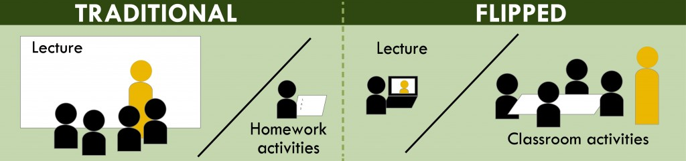

##JavaScript is better than C++?

I was skeptical when Professor Johnson gave us a presentation on why JavaScript is better than C and C++. Being a Computer Engineering major at the University of Hawaii at Manoa, the only language strictly taught in our curriculum is C and C++. This made me both anxious and excited to learn JavaScript, in which I had no previous experience.

Luckily, I’ve found thus far that the syntax and the structure of the language is very similar to C and C++. This definitely dampened the learning curve in learning JavaScript. The notable absence of pointers in the language has yet to affect me negatively or positively, consequently, I’m excited to see what else this language can do.

##Atheletic Software Engineering

From a software engineering perspective, it seems like JavaScript is a robust, simple and powerful language for software development. There are limitations within C and C++ that require difficult work arounds that JavaScript handles easily. 

I have yet to form a solid opinion on athletic software engineering. So far, I enjoy the process of the practice “Workouts of the Day” (WODs). They propose interesting problems that have practical applications. I enjoy the timing component of the WODs because it mimics real world interview and industry scenarios.

I remain optimistic about the style of learning in this class. I have had negative experiences with online course and flipped classrooms in the past, however; the structure of this class seems polished, organized and well thought out. Overall, I have had a very positive experience with JavaScript and the flipped classroom learning style thus far and remain hopeful that this will persist throughout the semester.

